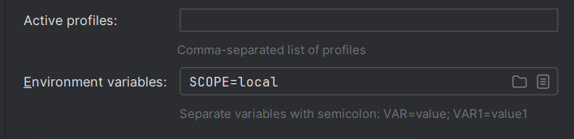
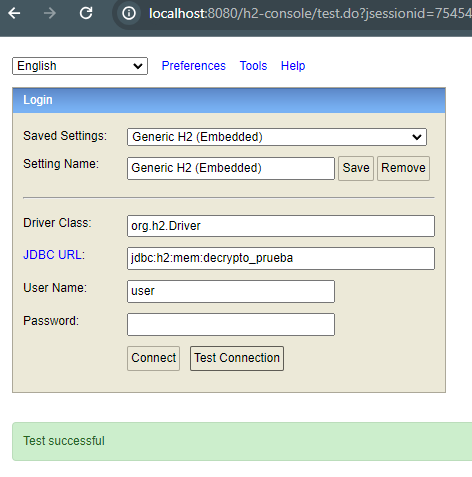

# Market Manager Api

REST API with CRUD operations
necessary to manage Clients and Market and their
relations.

## Installation

Download or clone the repository.

The api has 2 configurations:

To run it locally, you must set the profile to ```local```, in this environment an H2 database will be created, with an initial data loading script for generating tests.

The accesses for this profile are:

```
    password:
    url: jdbc:h2:mem:decrypto_prueba
    username: user
```
the url of access is:

```
http://localhost:8080/h2-console/
```






To run the API in a production environment, the selected profile must be ```prod```.

In this environment you will connect to a mysql database.

The productive url is https://market-management-api-production.up.railway.app/ 

## Documentation

in ```/resources/postman-collection```
you will find a postman collection to test microservices

Swagger Documentation: ```http://localhost:8080/doc/swagger-ui/```


